# Hey, I'm suzunn 👋

### AI Automator · Applied AI Researcher · CS @ Istanbul University

I don't just *use* AI — I build pipelines where AI ships real work. 
Automated open-source contribution workflows, developer CLIs, and applied ML.

 

---

## 🤖 What I do

- **AI-assisted open source** — I run a daily AI-augmented pipeline that triages maintainer feedback, keeps pull requests healthy, and ships focused fixes upstream. Merged into projects like `pnpm`, `remotion`, `sentry-javascript`, `hydra`, `theia`, and more — with active PRs across `fastify`, `storybook`, `weblate`, `CyberChef`, and friends.
- **Developer tooling** — small, dependency-free CLIs that turn messy workflows into checks you can run in seconds.
- **Applied ML & data** — notebooks and deployed apps: price prediction, clustering, computer vision, and NLP experiments.

> ⚙️ Transparency: much of my daily OSS work is orchestrated by an AI routine I designed — the pipeline drafts, the human reviews, quality gates decide. Every contribution is tested and written to be easy to review.

## 🚀 Featured

| Project | What it is |
|---|---|
| [`oss-pulse`](https://github.com/suzunn/oss-pulse) | **Live dashboard** of my open-source activity — auto-refreshed daily, zero manual edits |
| [`cache-compass`](https://github.com/suzunn/cache-compass) | Finds and safely removes stale dev caches across mixed-language repos |
| [`doclink-auditor`](https://github.com/suzunn/doclink-auditor) | Audits Markdown links and anchors so broken docs never ship |
| [`atomic-habits-chatbot`](https://github.com/suzunn/atomic-habits-chatbot) | RAG chatbot (AnythingLLM + Gemini) — [live demo](https://atomic-habits-chatbot.netlify.app) |
| [`Rental-Price-Prediction-in-Istanbul`](https://github.com/suzunn/Rental-Price-Prediction-in-Istanbul) | Scraping → features → models → [deployed Streamlit app](https://rental-price-prediction-in-istanbul.streamlit.app) |
| [`Data-Science-Projects`](https://github.com/suzunn/Data-Science-Projects) | 30+ ML/DL notebooks: tabular, CV, NLP, recommenders, time series |

## 🧰 Toolbox

## 📊 Stats

<picture>
  <source media="(prefers-color-scheme: dark)" srcset="https://raw.githubusercontent.com/suzunn/suzunn/output/github-contribution-grid-snake-dark.svg" />
  
</picture>

---

📬 Open to collaboration on AI automation, developer tooling, and open source. Reach me right here on GitHub.

